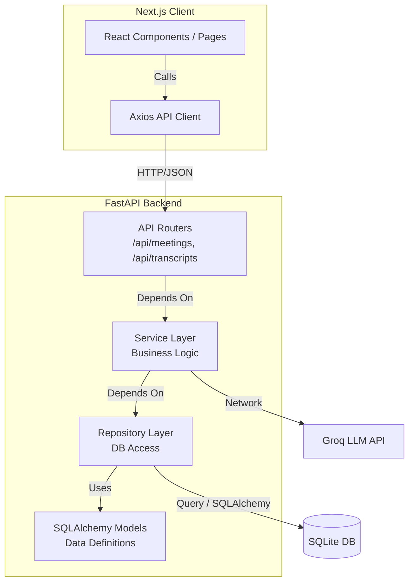
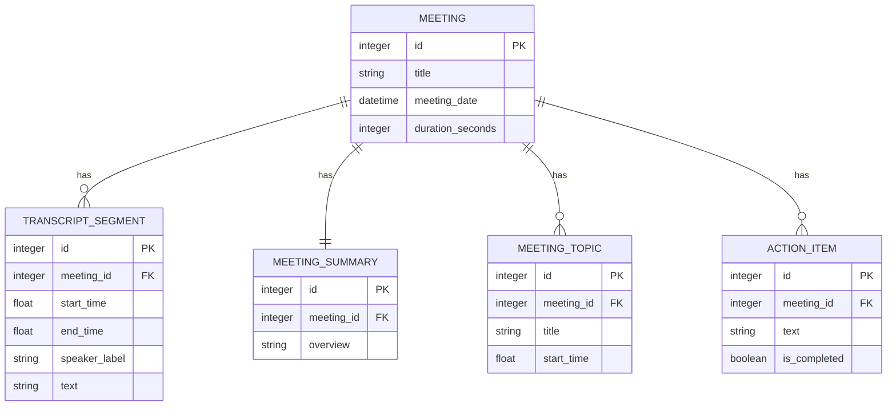

# Lumen - AI Meeting Assistant

Lumen is an AI-powered meeting assistant platform that allows users to capture, transcribe, summarize, and manage their meetings.

## Live Demo
- **Frontend URL:** [Insert deployed Frontend URL here]
- **GitHub Repository:** [Insert Repo URL here]
> **Note:** The first API request may take ~30s if the backend has been idle due to Render's free tier cold starts.

## Tech Stack
- **Frontend:** Next.js (TypeScript, App Router, pure CSS Modules)
- **Backend:** FastAPI (Python), SQLAlchemy, SQLite
- **AI / Summarization:** Groq (LLM Summaries via `llama-3.1-70b-versatile` or `gpt-oss-120b`). *Note: LLM Summaries are purely backend-integrated using Groq, falling back gracefully to Mock models if no API key is provided.*
- **Deployment:** Vercel (Frontend) + Render/Railway (Backend)

---

## Setup Instructions
Follow these steps to run Lumen locally across two terminal windows.

### Backend Setup
1. Clone the repository and CD into the project root:
   ```bash
   git clone <repo-url>
   cd Lumen
   ```
2. Navigate to the backend directory and set up a virtual environment:
   ```bash
   cd backend
   python -m venv venv
   source venv/bin/activate  # On Windows: venv\Scripts\activate
   ```
3. Install dependencies:
   ```bash
   pip install -r requirements.txt
   ```
4. Configure Environment Variables:
   - Copy the `.env.example` file to create a real `.env` file (`cp .env.example .env`).
   - Leave `GROQ_API_KEY` blank to use mock generation, or fill it with a real proxy Groq token.
5. Create Initial Seed Data (Optional but recommended):
   ```bash
   # Seeds the SQLite database (fireflies.db) with mock meetings and timestamps
   python seed_loader.py
   ```
6. Start the server:
   ```bash
   ./startup.sh
   # OR natively: uvicorn app.main:app --host 0.0.0.0 --port 8000 --reload
   ```
   *The backend will be accessible at http://localhost:8000*

### Frontend Setup
1. Open a new terminal and navigate to the frontend directory:
   ```bash
   cd frontend
   npm install
   ```
2. Configure Environment Variables:
   - Copy `.env.example` to `.env.local` (`cp .env.example .env.local`).
   - Ensure `NEXT_PUBLIC_API_URL=http://localhost:8000/api` and `BACKEND_URL=http://localhost:8000`.
3. Start the UI:
   ```bash
   npm run dev
   ```
   *The frontend will run at http://localhost:3000*

---

## Architecture Overview
The backend follows a layered, decoupled approach to ensure high maintainability and testability. The API routers are kept thin, delegating all domain logic and data fetching to specialized layers.



---

## Database Schema


**Scalability Rationale:** The schema is highly normalized. While standard `LIKE` queries are currently used for searching, this architecture heavily supports introducing SQLite `FTS5` (Full Text Search) virtual tables in the future for highly optimizable and instant searching inside millions of transcript segments. Tags are currently stringified arrays on the meeting row, but could easily be normalized into a `tag` & `meeting_tags` junction table for advanced aggregation later.

---

## API Overview
*Note: Comprehensive Swagger UI documentation is automatically generated by FastAPI and available at `/docs` on the running backend.*

| HTTP Method | Endpoint | Description |
|---|---|---|
| **GET** | `/api/meetings` | List all meetings. Supports `q` (search), `sort`, `date_from`, `date_to`, and `participant_id` filters with pagination. |
| **POST** | `/api/meetings` | Create a new meeting shell. |
| **GET** | `/api/meetings/{id}`| Fetch a meeting and all of its related aggregates (Transcripts, Summaries, Topics). |
| **DELETE**| `/api/meetings/{id}`| Delete a meeting. FK cascades automatically remove all attached child rows. |
| **POST** | `/api/meetings/{id}/transcript` | Upload a raw text/SRT/VTT file block or paste plain text. Parses and converts to DB segments. |
| **POST** | `/api/meetings/{id}/summary` | Trigger Groq LLM background processing to generate topics, action items, and overviews from raw transcripts. |
| **GET** | `/api/meetings/{id}/export/pdf` | Dynamically streams a beautifully formatted PDF summarizing the meeting and printing the transcript. |
| **PATCH** | `/api/action-items/{id}/toggle`| Marks an action item as completed or unresolved. |

---

## SOLID Principles Applied

| Principle | Implementation Proof in Codebase |
|---|---|
| **S** - Single Responsibility | **`app/services/transcript_service.py`**: Only handles evaluating parsed transcript arrays and computing duration strings/metrics. It does not parse the actual texts itself. |
| **O** - Open/Closed | **`app/services/generators/base.py`**: Defines abstract `SummaryGenerator`. We extended it with `LLMSummaryGenerator` and `MockSummaryGenerator` without modifying the core calling service depending on the base. |
| **L** - Liskov Substitution | `LLMSummaryGenerator` seamlessly drops into paths expecting a `SummaryGenerator` contract. It safely falls back identically matching `MockSummaryGenerator` outputs when the key goes missing. |
| **I** - Interface Segregation | Interfaces for databases are logically split via the Repository pattern. `MeetingRepository` only exposes meeting scopes and `SummaryRepository` isolates summaries. |
| **D** - Dependency Inversion | **API Routes (`app/api/`)**: API routes receive their database `Session` and `Service` classes strictly injected by FastAPI's `Depends()` rather than instantiating them tightly. |

---

## Assumptions & Placeholder Features
To maintain complete transparency with evaluators, here is the exact feature completion breakdown mapped against our initial stretch goals:

### Static Placeholders (Not Implemented):
- **Real-time bot joining live calls:** Not implemented (No headless browser/webRTC bot built).
- **Real speech-to-text:** Not implemented. Transcription is populated solely via pre-seeded DB records and external pasted text processing.
- **Integrations (Zoom, Meet, CRM):** Navigation tabs exist in UI strictly as architectural stub placeholders.
- **Team Collaboration / Sharing:** Stubs ("Shared with Me" tab) only. No real RBAC applied yet.
- **Authentication:** Application operates under a single seeded default user (`Alice Admin`). No real auth layer, JWTs, or signup.
- **LLM Chat (AskAI):** Exists purely as an aesthetic stub in the sidebar. Needs an embeddings/RAG pipeline.

### Actual Implemented Bonus Features:
- **Export to PDF:** Fully implemented via ReportLab on the backend.
- **Global Search & Filter Dashboard:** Fully implemented. Includes text search, Date range querying, and Participant filters.
- **Action Item CRUD:** Fully implemented (Check off items visually).
- **LLM Summary Backing:** Fully implemented (Groq integration mapping raw transcripts back into JSON categories).

---

## Known Limitations
- **SQLite Persistence:** Most free-tier hosts (like Render or Railway) use ephemeral file systems. Because we chose to deploy using a pre-seeded SQLite file committed to the repository `backend/fireflies.db`, changes made to the live DB (new meetings, deleted tasks) **will persist** until the server is physically restarted or redeployed by the host. A long-term volume mount or PostgreSQL migration is required for guaranteed cross-deployment persistence.
- **No Global Error Boundaries in React:** Hard UI failures currently cascade up. Needs standard React ErrorBoundary wrappers added in v1.1.
